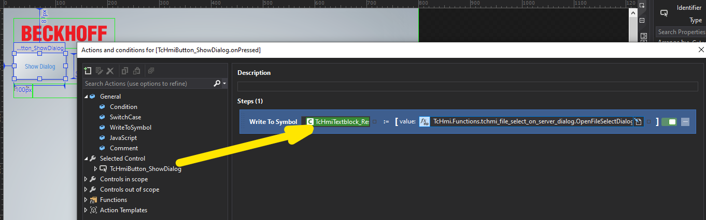

# Simple example of creating a file selection dialog using a UserControl in TwinCAT HMI

## Disclaimer

This is a personal guide not a peer reviewed journal or a sponsored publication. We make
no representations as to accuracy, completeness, correctness, suitability, or validity of any
information and will not be liable for any errors, omissions, or delays in this information or any
losses injuries, or damages arising from its display or use. All information is provided on an as
is basis. It is the reader’s responsibility to verify their own facts.

The views and opinions expressed in this guide are those of the authors and do not
necessarily reflect the official policy or position of any other agency, organization, employer or
company. Assumptions made in the analysis are not reflective of the position of any entity
other than the author(s) and, since we are critically thinking human beings, these views are
always subject to change, revision, and rethinking at any time. Please do not hold us to them
in perpetuity.

## Overview

This is a small example of creating a file selection dialog in the TwinCAT HMI API.  Also be sure to check out this other great post by Jack Borelius found [here](https://www.linkedin.com/pulse/file-explorer-virtual-directory-jack-borelius/).

## Getting started

Open TwinCAT HMI and switch to liveview. Press Show Dialog to see the results. Feedback is shown on the result label

## Screenshot


## Adding the dialog to your own project

You will neet to copy the two files shown below to your project.


## Triggering and writing the result of the selection

You can use a WriteToSymbol command to both trigger the dialog and write the file path as a string to a PLC or local variable. In the example this is written to the label's text field.



### Calling the function

The example shows the standard call to the function. This allows single folders or files to be selected and shall start at the root folder "/".

```javascript
TcHmi.Functions.tchmi_file_select_on_server_dialog.OpenFileSelectDialog("", "");
```

You can restrict the dialog to a file extension by using the second argument. E.g ".js" will only allow JavaScript files.

```javascript
TcHmi.Functions.tchmi_file_select_on_server_dialog.OpenFileSelectDialog(
  "",
  ".js"
);
```

You can start the dialog in a folder within the route by providing the relative path in the first argument. E.g. using '/bin' will start within the bin folder.

```javascript
TcHmi.Functions.tchmi_file_select_on_server_dialog.OpenFileSelectDialog(
  "/bin",
  ".js"
);
```

The return of the function is the selected file + path. If no file or folder is selected, or cancel is pressed then an empty string is returned.

## Styling Adjustments

Styling changes can be made to the dialog by editing the FileSelectDialog.usercontrol

Styling of the backdrop and dialog positioning can be changed by editing the following lines in OpenFileSelectDialog.js

```javascript
// This controls the color of the backdrop
dialogBackdrop.setBackgroundColor({
  color: "rgba(0, 0, 0, 0.4980392)",
});
```

```javascript
// This controls the position and layer of the dialog
var dialog = TcHmi.ControlFactory.createEx(
  "TcHmiUserControlHost",
  generateUniqueId(),
  {
    "data-tchmi-left": "50", // this horizontally centers the dialog on the screen (this works with the -50% translation)
    //'data-tchmi-left-unit': "%",
    //'data-tchmi-target-user-control': 'UserControls/FileSelectDialog.usercontrol',
    "data-tchmi-top": "50", // this vertically centers the dialog on the screen (this works with the -50% translation)
    //'data-tchmi-top-unit': "%",
    //'data-tchmi-width-mode': "Content",
    //'data-tchmi-height-mode': "Content",
    "data-tchmi-zindex": "1050", // this controls the layer height of the dialog
  },
  desktop
);
```

## Versions

- TcXaeShell 3.1.4024.44
- TwinCAT HMI 1.12.758.8

## Need more help?

Please visit http://beckhoff.com/ for further guides
